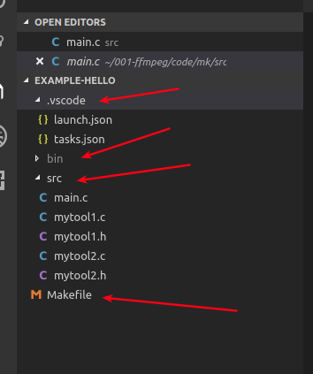

# wukong-c

为了能快速上手c开发，撰写了这个文档．

> 目录

* [前提条件](#前提条件)
* [下载代码](下载代码)
* [Git日常操作](#git日常操作)
* [环境搭建](#环境搭建)
  * [单一工程项目](#单一工程项目)
  * [学习类型项目](#学习类型项目)
  * [引用第三方库项目](#引用第三方库项目)


## 前提条件

* 环境
  * ubuntu(推荐)
  * git
  * vscode
  * 文档撰写工具(可选)
    * typora(md编写工具)
    * 屏幕截图工具Shutter
* 基本知识
  * gcc编译过程
  * makefile文件编写过程
  * c基本知识


## 下载代码

```shell
# 选择一个目录
git clone https://github.com/fanhualei/wukong-c.git
cd wukong-c
```


## Git日常操作

```shell
# 查看当前git的配置
git config --list

# 查看当前目录的文件状态　可以不加-s 这样提示会更多
git status -s

# 提交到本地
git commit -m "注释的内容"

# 跳过使用暂存区域 给 git commit 加上 -a 选项，
git commit -m -a "注释的内容"

# 推送到远程仓库,要输入用户名与密码，我懒得修改成ssh了
git push

# 查看远程服务器的
git remote show
```


> 参考文档

* [git使用官方文档](https://www.git-scm.com/book/zh/v2)


## 环境搭建

现在的c教程，讲解的大部分都是语法，但是在实际工作中会遇到很多教程没有讲解的内容，例如如何组织工程目录，如何使用静态库动态库，版本控制等等．下面分三部分来具体说明一下开发过程中的环境搭建．


### 单一工程项目

本例子假设有一个`main`函数，还有多个相关c文件，组合成一个项目，演示了如何通过`makefile`与`vscode`组织与调试程序

开发步骤，首先写`src`中的代码，然后写`makefile`文件，最后配置`vscode`．

相关源码见：[hello代码](https://github.com/fanhualei/wukong-c/tree/master/example-hello>)


> 执行代码

```shell
# 下载完代码，进入wukong-c目录,使用vscode打开工程,前提已经安装了vscode
code ./example 

# 执行debug操作，看到执行结果．
```


> 工程概况

* `src`源代码
* `bin`编译后的文件
* `makefile`编译脚本(重点)
* `.vscode`配置调试相关内容




> makefile文件说明

通过makefile可以方便的进行编译

```shell

CC		:= gcc
# 指定了提示错误的级别，-g表示要进行debug，在发布的时候，可以将-g给去掉．
CFLAGS  := -Wall -Wextra -g
BIN		:= bin
SRC		:= src

# 下面三个现在还没有用
INCLUDE	:= include
LIB		:= lib
LIBRARIES	:=

# 指定生成的文件名称
ifeq ($(OS),Windows_NT)
EXEC	:= main.exe
else
EXEC	:= main
endif


all:$(BIN)/$(EXEC)

run:all
	$(BIN)/$(EXEC) 

clean:
	rm -rf $(BIN)/$(EXEC)

# 将src下的文件都编译了
$(BIN)/$(EXEC):$(SRC)/*
	gcc $^ -o $@  $(CFLAGS)
```


> vscode配置

`launch.json`与`tasks.json`可以通过向导自动生成，然后修改．当然也可以在本例子的基础上进行修改．


* `lauch.json`配置

具体的修改内容有：`program`,`preLaunchTask`．其中`preLaunchTask`是用来关联一个`task`用来在执行前，先编译一下代码．如果不怕麻烦，每次debug前手工执行make，与可以不加`preLaunchTask`

```json
// Use IntelliSense to learn about possible attributes.
// Hover to view descriptions of existing attributes.
// For more information, visit: https://go.microsoft.com/fwlink/?linkid=830387
{

    "version": "0.2.0",
    "configurations": [


        {
            "name": "运行并调试",
            "type": "cppdbg",
            "request": "launch",
            "program": "${workspaceFolder}/bin/main",
            "args": [],
            "stopAtEntry": false,
            "cwd": "${workspaceFolder}",
            "environment": [],
            "externalConsole": false,
            "preLaunchTask": "build",
            "MIMode": "gdb",
            "setupCommands": [
                {
                    "description": "Enable pretty-printing for gdb",
                    "text": "-enable-pretty-printing",
                    "ignoreFailures": true
                }
            ]
        }
    ]
}
```

* `tasks.json`

  执行了make命令

```json
// See https://go.microsoft.com/fwlink/?LinkId=733558
// for the documentation about the tasks.json format
{

    "version": "2.0.0",
    "tasks": [
        {
            "label": "build",
            "type": "shell",
            "command": "make",
            "args": [
            ],
            "group": "build",
            "presentation": {
                "reveal": "silent"
            },
        }
    ]
}
```

[变量参考](https://code.visualstudio.com/docs/editor/variables-reference)

> c_ccp_properties.json

用`Ctr`+`Shift`+`p`打开对话框，然后选择`C/C++: edit configrations(json)`,这样会默认生成一个．

参考文档：

* [官方文档](https://code.visualstudio.com/docs/languages/cpp)


### 学习类型项目

这类项目有很多单一的可执行文件，所以不用makefile来编译，可以使用vscode自带的编译与debug工具来执行．


> 怎么建立这样的工程呢？

```
1:建立一个空目录．
2:使用vscode打开这个目录
3:建立一个src目录，然后在里面建立一个子目录后，建立main.c,写入一个最简单的程序．
4:打开vscode的debug工具，按照提示建立一个launch.json,然后执行，按照提示建立一个gcc的tasks.json
5:这时候可以执行这个程序
```

如果不想自己编辑上述文件，[就从github上下载代码](https://github.com/fanhualei/wukong-c/tree/master/example-study)

> 程序的规则

* 参考了，[菜鸟－C 语言教程](https://www.runoob.com/cprogramming/c-tutorial.html)
* 代码中的注释，有菜鸟网站对应的HTTP地址．
* 每个章节一个目录，如果没有代码的章节，没有目录，跳过．
* args中要添加 -lm,因为引入和数学基本类库

```json
// See https://go.microsoft.com/fwlink/?LinkId=733558 
// for the documentation about the tasks.json format
{
    "version": "2.0.0",
    "tasks": [
        {
            "type": "shell",
            "label": "gcc build active file",
            "command": "/usr/bin/gcc",
            "args": [
                
                "${file}",
                "-o",
                "${fileDirname}/${fileBasenameNoExtension}.out",
                "-lm",
                "-Wall",
                "-Wextra",
                "-g"    
            ],
            "options": {
                "cwd": "/usr/bin"
            },
            "problemMatcher": [
                "$gcc"
            ]
        }

    ]
}
```


### 引用第三方库项目

例如`ffmpeg`二次开发，那么就需要引用第三方类库，像这类文件应该如何搭建环境呢？

在搭建`ffmpeg`开发环境时，最主要的是要做好makefile文件


#### 第一步：建立makefile文件

通过`vscode`传入一个文件名称，并且编译，同时进行debug．

这个文件通过`shell pkg-config`来得到`ffmpeg`的头文件和`lib`包．

```makefile
CC      := gcc
BIN		:= bin
SRC		:= src

# 使用pkg-config得到ffmpeg的头文件与lib
FFMPEG_LIBS=    libavdevice                        \
                libavformat                        \
                libavfilter                        \
                libavcodec                         \
                libswresample                      \
                libswscale                         \
                libavutil                          \
# CFLAGS例如：-I/usr/local/include -Wall -g
# https://www.jianshu.com/p/70858c4e6f5e
# LDLIBS例如：-L/usr/local/lib -lavdevice -lm -ldl -lz -pthread -lavfilter -lm -ldl -lz -pthread -lavformat -lm -ldl -lz -pthread -lavcodec -lm -ldl -lz -pthread -lswresample -lm -lswscale -lm -lavutil -lm

CFLAGS := $(shell pkg-config --cflags $(FFMPEG_LIBS))
CFLAGS += -Wall -g
LDLIBS := $(shell pkg-config --libs $(FFMPEG_LIBS)) $(LDLIBS)

# 从外部传入一个文件名字，进行编译, CFILES 是要编译的c文件，如果要编辑多个c，那么就要通过if判断，来生成多个c编译内容．
F  :=avio_dir_cmd
CFILES :=$(F).c


.PHONY : all


all:$(BIN)/$(F)
	@echo "\nmake all ok:" $(BIN)/$(F)

run:all
	$(BIN)/$(F) 

clean:
	rm -rf $(BIN)/$(F)
	@echo "clean ok"

cleanAll:
	rm -rf $(BIN)/*
	@echo "clean all ok"	
	
$(BIN)/$(F):$(SRC)/$(CFILES)
	$(CC) $^  $(CFLAGS) $(LDLIBS)   -o $@ 

```


#### 第二步：写一个.c文件

将`ffmpeg`的两个例子文件复制到`src`目录下．

#### 第三步：进行调试配置


> 添加一个launch.json文件

主要修改了`program`

```json
    // Use IntelliSense to learn about possible attributes.
    // Hover to view descriptions of existing attributes.
    // For more information, visit: https://go.microsoft.com/fwlink/?linkid=830387
    {
        "version": "0.2.0",
        "configurations": [
            {
                "name": "(gdb) Launch",
                "type": "cppdbg",
                "request": "launch",
                "program": "${workspaceFolder}/bin/${fileBasenameNoExtension}",
                "args": [],
                "stopAtEntry": false,
                "cwd": "${workspaceFolder}",
                "environment": [],
                "externalConsole": false,
                "MIMode": "gdb",
                "setupCommands": [
                    {
                        "description": "Enable pretty-printing for gdb",
                        "text": "-enable-pretty-printing",
                        "ignoreFailures": true
                    }
                ],
                "preLaunchTask": "gcc build active file"
            }
        ]
    }
```


> 添加tasks.json文件

核心是添加了`make F=${fileBasenameNoExtension}`，来执行当前打开的文件．

```json
// See https://go.microsoft.com/fwlink/?LinkId=733558
// for the documentation about the tasks.json format
{
    "version": "2.0.0",
    "tasks": [
        {
            "type": "shell",
            "label": "gcc build active file",
            "command": "make F=${fileBasenameNoExtension}",
            "args": [],
            "options": {},
            "problemMatcher": [
                "$gcc"
            ]
        }
    ]
}
```

