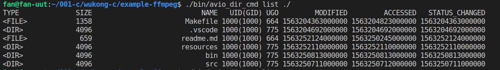

# Ffmpeg-Example 例子说明

这里主要是为了学习C语言做的笔记．　其中`ffmpeg`的例子是从官网上复制下来的，使用的是`3.6.4`版本．


## test.c

这个例子用来进行测试，当看代码语法不清楚的时候，在里面实验一下．


## 目录操作-avio_dir_cmd.c

为了debug这个例子，我在`launch.json`中添加了参数:`"args": ["list","resources"]`,如果要debug其他的例子，请将这个参数删除．


> 功能概述

这个例子使用了avio.h目的是为了操作文件．

```
本例子主要实现了以下三个功能：
１：list 查询一个目录
２：del 删除一个文件
３：move 变更一个文件的名称

```


> 使用方法

```
avio_dir_cmd list 目录名：必须是一个文件名．
avio_dir_cmd del  目录名文件名
avio_dir_cmd move 老文件名　新文件名

```



> 用的知识点	

```
# 系统函数
	snprintf　字符串操作
	# define　常量定义
＃ ffmpeg函数
	av_log　日志的使用
	avio_open_dir　avio_read_dir　avio_free_directory_entry　avio_close_dir　遍历目录
	avpriv_io_delete　删除文件
	avpriv_io_move　变更文件名
```


> 其他

为了测试，我截取了一个30秒的测试文件，并放到了resources目录下

```
ffmpeg -ss 0  -i aaa.mp4 -to 30  -c copy  test.mp4
```

