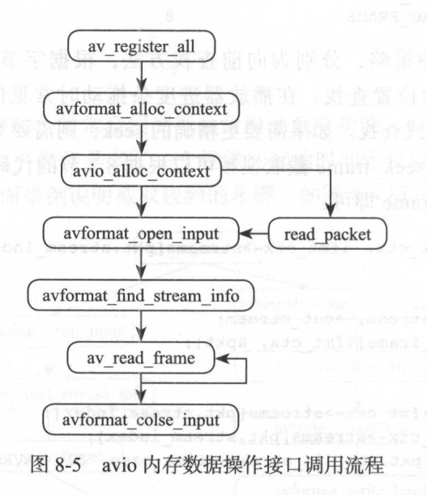
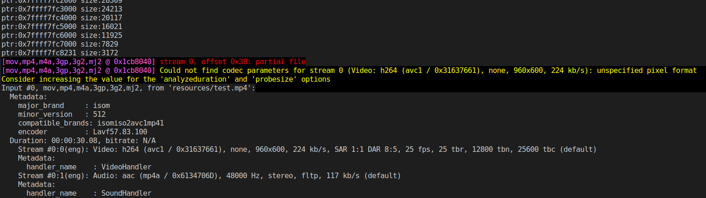
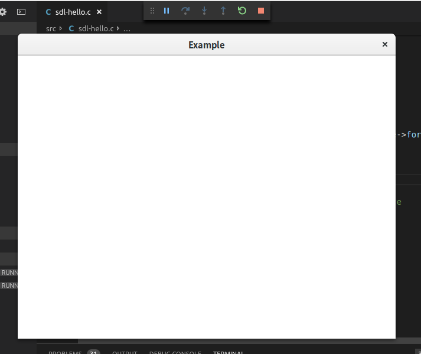
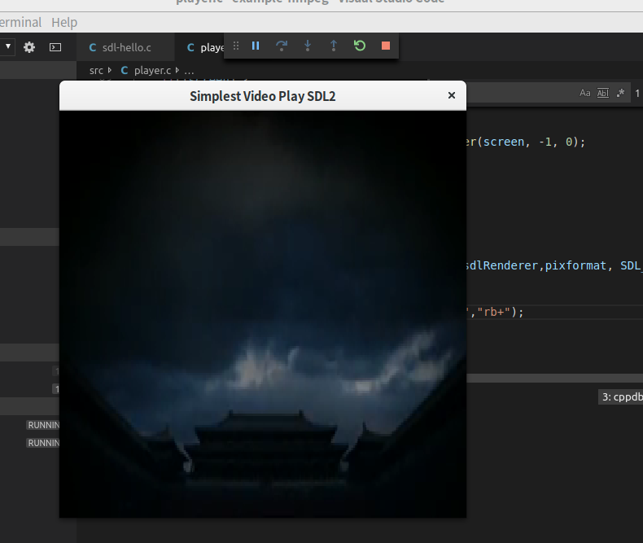

# Ffmpeg-Example 例子说明

这里主要是为了学习C语言做的笔记．　其中`ffmpeg`的例子是从官网上复制下来的，使用的是`3.6.4`版本．


## 基础总结


> 经常出现变量类型－在C课本里面没有

`_t`表示是通过`# difine`定义的

| define  | 实际              | 用户                            |
| ------- | ----------------- | ------------------------------- |
| size_t  | long unsigned int | 为了解决32位与64位中，int的区别 |
| uint8_t | unsigned char     | 经常看到这个来定义`指针`        |
|         |                   |                                 |


> 常见的一些函数


| 函数名 | 函数格式                                             | 说明                                                 |
| ------ | ---------------------------------------------------- | ---------------------------------------------------- |
| memcpy | void *memcpy(void *str1, const void *str2, size_t n) | 从存储区 **str2** 复制 **n** 个字符到存储区 **str1** |
|        |                                                      |                                                      |
|        |                                                      |                                                      |


## 自己的例子


### test.c

这个例子用来进行测试，当看代码语法不清楚的时候，在里面实验一下．


## 其他例子


### 目录操作-avio_dir_cmd.c

为了debug这个例子，我在`launch.json`中添加了参数:`"args": ["list","resources"]`,如果要debug其他的例子，请将这个参数删除．


> 功能概述

这个例子使用了avio.h目的是为了操作文件．

```
本例子主要实现了以下三个功能：
１：list 查询一个目录
２：del 删除一个文件
３：move 变更一个文件的名称

```


> 使用方法

```
avio_dir_cmd list 目录名：必须是一个文件名．
avio_dir_cmd del  目录名文件名
avio_dir_cmd move 老文件名　新文件名

```


> 用的知识点	

```
# 系统函数
	snprintf　字符串操作
	# define　常量定义
＃ ffmpeg函数
	av_log　日志的使用
	avio_open_dir　avio_read_dir　avio_free_directory_entry　avio_close_dir　遍历目录
	avpriv_io_delete　删除文件
	avpriv_io_move　变更文件名
```


> 其他

为了测试，我截取了一个30秒的测试文件，并放到了resources目录下

```
ffmpeg -ss 0  -i aaa.mp4 -to 30  -c copy  test.mp4
```


## libavformat使用


### 内存数据操作-avio_reading.c


> 功能说明

在一些应用场景中需要从内存数据中读取 H.264 据，然后将 H.26 数据封装为 FLY格式或者 MP4 格式，使用 FFmpeg libavformat 中的 avio 方法即可达到该目的．

这样从内存中直接操作数据的方式常常被应用于操作已经编码的视频数据或音频数据，然后希将数据通过 FFmpeg 直接封装到文件中． 下面看 下封装内存数据的 API 调用步骤．




> 功能描述

打开一个文件，然后读取大小，然后输出文件的内容．





> 执行步骤


* av_register_all
* av_file_map
* avformat_alloc_context
* av_malloc
* avio_alloc_context
* avformat_open_input
* avformat_find_stream_info
* av_dump_format
* 结束
  * avformat_close_input
  * av_freep
  * av_file_unmap


### 封装-muxing.c


> 功能说明

<<ffmpeg从入门到精通>>的8.1章有讲解


### 解封装-demuxing_decoding.c

> 功能说明

<<ffmpeg从入门到精通>>的8.2章有讲解


### 转封装与视频截取-remuxing.c

<<ffmpeg从入门到精通>>的8.3与8.4章有讲解


## libavcodec使用


### 音频编码-encode_audio.c

<<ffmpeg从入门到精通>>的9.2.1章有讲解


### 音频解码-decode_audio.c

<<ffmpeg从入门到精通>>的9.2.2章有讲解


### 视频编码-encode_video.c

<<ffmpeg从入门到精通>>的9.2.3章有讲解


### 视频解码-decode_video.c

<<ffmpeg从入门到精通>>的9.2.4章有讲解


## libavfilter使用

### 添加logo-filtering_video.c

<<ffmpeg从入门到精通>>的10.4章有讲解


## SDL开发的例子

在使用的过程中，参考了[Dwyane05博客](https://blog.csdn.net/cyf15238622067/article/category/8096110)


### 显示一个窗口

`sdl-hello.c`例子



### 播放一个视频

`player.c`例子



